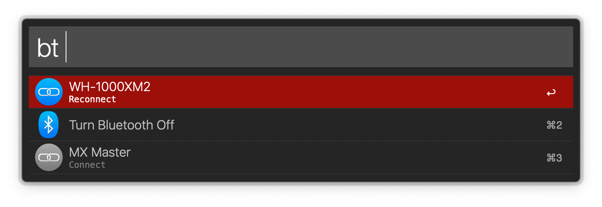

# Alfred blueutil
Allows you to (re)connect to already paired bluetooth devices (such as AirPods) through Alfred and to toggle bluetooth on/off.

Uses a fork of [Ivan Kuchins](https://github.com/toy/blueutil) / [Frederik Seifferts blueutil](http://www.frederikseiffert.de/blueutil/)
to be able to toggle the power state of the bluetooth controller.

Tested on macOS 10.14.

Activate in Alfred via ```bt``` Keyword followed by the device name.

Hold ```alt``` to disconnect.




The workflow is inspired by https://github.com/uchida/alfred-switch-bluetooth and the icons are originally bundled with macOS.
If someone figures out how to access the device specific icons listed in the Bluetooth Preferences, tell me about it!
